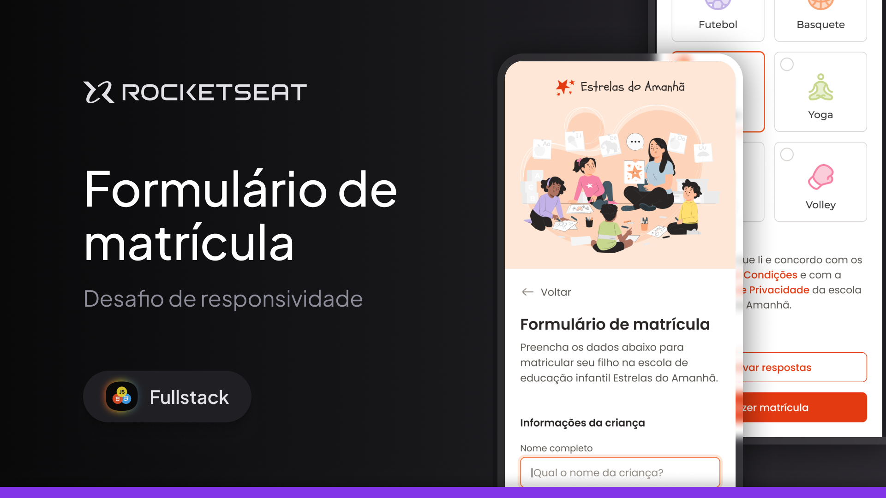

# Formação Full-Stack: Formulário de matrícula

Acesse em: <a href="https://limacaiquelg.github.io/fullstack-formulario-matricula/">https://limacaiquelg.github.io/fullstack-formulario-matricula/</a>

 

Este projeto consiste em uma página web desenvolvida utilizando HTML e CSS. Esta página exibe um formulário de matrícula para uma escola infantil, com diversos tipos de campos de entrada, checkboxes, radio buttons, etc.
 

Os seguintes tópicos são trabalhados nesta aplicação: 

<ul>
  <li>Formulários HTML</li>
  <li>Inputs de texto</li>
  <li>Estilização de inputs com CSS</li>
  <li>Inputs de data</li>
  <li>Radio buttons</li>
  <li>Estilização de formulários com CSS</li>
</ul>

Este projeto foi desenvolvido durante a formação Full-Stack da Rocketseat, sob a orientação do professor <a href="https://github.com/maykbrito">Mayk Brito</a>. Posteriormente, tornou-se parte do desafio de responsividade dessa mesma formação, trabalhando os seguintes tópicos: 

<ul>
    <li>Responsividade</li>
    <li>Media Queries</li>
    <li>Utilização da ferramenta DevTools do navegador</li>
</ul>

As alterações necessárias para tornar a página responsiva estão contidas no commit <a href="https://github.com/limacaiquelg/fullstack-formulario-matricula/commit/031b7c3e0ac02c53ae13cf5e2bc65606155397e1">031b7c3</a>.

Este projeto faz parte da formação Full-Stack da <a href="https://www.rocketseat.com.br">Rocketseat</a>.
